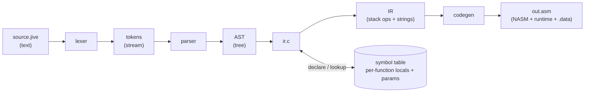

# jivec


[](LICENSE)


A from-scratch compiler for **Jive**, written in C, targeting x86-64 NASM assembly.

Jive is a small teaching language designed by **Professor Lothar Narins** for CS 5008 at Northeastern University. `jivec` is my implementation of the course compiler — built up stage by stage, from lexer to codegen.

## Status

- [x] Stage 1 — lexer
- [x] Stage 2 — parser + minimal codegen (empty-param `fn`s whose body is `return <int>`)
- [x] Stage 3 — arithmetic expressions + stack-machine IR
- [x] Stage 4 — local variables (`let` / `set`) + symbol table
- [x] Stage 5 — function calls, arguments, and parameters
- [x] Stage 6 — boolean expressions, `if` / `else` / `while`
- [x] Stage 7 — strings, printing, dynamic memory (`alloc`), array indexing

## The Jive language

Jive is a small, statically-typed language with a Rust-flavored syntax. A program is a sequence of function definitions, and `main` is the entry point — the compiler calls it and uses its return value as the process exit code.

### A minimal program

```jive
fn main() -> int
{
    return 42
}
```

Build it, then run the assembled binary:

```sh
./build/jive hello.jive -o hello.asm
nasm -felf64 hello.asm -o hello.o && ld hello.o -o hello
./hello; echo "exit=$?"   # exit=42
```

### Keywords, types, and operators

- **Keywords:** `fn` `let` `set` `if` `while` `call` `return` `true` `false`
- **Types:** `int` `str` `bool`
- **Unary operators:** `-` `~` `!`
- **Binary operators:** `+ - * / %` &nbsp; `& | ^` &nbsp; `== != < > <= >=` &nbsp; `&& ||`
- **Grouping / punctuation:** `( )` `[ ]` `{ }` `,` `:` `->`
- **Comments:** `// ...` to end of line

### Statements

| Statement | Form                                  | Purpose                                          |
|-----------|---------------------------------------|--------------------------------------------------|
| `let`     | `let name: type [= expr]`             | declare a variable, optionally initialized      |
| `set`     | `set name = expr`                     | assign to an existing variable                  |
| `return`  | `return [expr]`                       | return from the current function                |
| `if`      | `if cond stmt [else stmt]`            | conditional branch                              |
| `while`   | `while cond stmt`                     | loop                                            |
| `call`    | `call fn_name(args)`                  | invoke a function for its side effects          |

A `stmt` may be any single statement or a `{ ... }` block.

### Examples

Local variables (compiles and runs today — the program below exits with code 42):

```jive
fn main() -> int
{
    let a: int = 1     // a = 1
    let b: int = a + 5 // b = 6
    set a = b * 2      // a = 12
    set b = a * 3      // b = 36
    return a + b - 6   // return 42
}
```

Function calls with parameters (compiles and runs today — exits with code 25):

```jive
fn square(x: int) -> int
{
    return x * x
}

fn len_sq(x: int, y: int) -> int
{
    return square(x) + square(y)
}

fn main() -> int
{
    return len_sq(3, 4)   // 9 + 16 = 25
}
```

Hello World using the built-in `print` / `print_int` / `print_nl` runtime:

```jive
fn main() -> int
{
    call print("The answer is ")
    call print_int(42)
    call print_nl()
    call print("What is the question?")
    call print_nl()
    return 0
}
```

prints

```
The answer is 42
What is the question?
```

Heap-allocated arrays via the built-in `alloc(item_count) -> [any]`:

```jive
fn main() -> int
{
    let array: [int] = alloc(2)
    set array[0] = 23
    set array[1] = 19
    return array[0] + array[1]   // exits with 42
}
```

Recursive Fibonacci with conditionals and a loop (compiles and runs today — exits with code 88):

```jive
fn fib(n: int) -> int
{
    if n <= 1 return n
    return fib(n - 1) + fib(n - 2)
}

fn main() -> int
{
    let result: int = 0
    let n: int = 0
    while n < 10
    {
        set result = result + fib(n)
        set n = n + 1
    }
    return result   // 0+1+1+2+3+5+8+13+21+34 = 88
}
```

Conway's Game of Life ([jive_programs/gol.jive](jive_programs/gol.jive)) exercises pretty much every feature stage by stage — `[bool]` arrays from `alloc`, indexed reads and writes, nested `while`s, `if`/`else`, recursion through `count_neighbors`, and `print` / `print_int` / `print_nl` for the rendering. The reference 8×8 glider iterates 12 times and prints frames like:

```
Iteration: 0           Iteration: 1
+----------------+     +----------------+
|                |     |                |
|    []          |     |                |
|      []        |     |  []  []        |
|  [][][]        |     |    [][]        |
|                |     |    []          |
|                |     |                |
|                |     |                |
|                |     |                |
+----------------+     +----------------+
```

A loop with side-effectful calls (assuming built-ins `print_int` and `print_nl`):

```jive
fn main() -> int
{
    let n: int = 0
    while n < 10 {
        call print_int(n)
        call print_nl()
        set n = n + 1
    }
    return n - 10
}
```

### Grammar (EBNF)

```ebnf
letter          = "A"-"Z" | "a"-"z" ;
digit           = "0"-"9" ;
identifier      = ( "_" | letter ) , { "_" | letter | digit } ;
number          = digit , { digit } ;
string          = '"' , { ? all characters ? - ( '"' | '\n' ) } , '"' ;

type            = "int" | "str" | "bool" ;
primitive       = ( identifier , { subscript } )
                | number
                | call_expr
                | ( "(" , expr , ")" ) ;
unop            = "-" | "~" | "!" ;
binop           = "+" | "-" | "*" | "/" | "%" | "&" | "|" | "^"
                | "==" | "!=" | "<" | ">" | "<=" | ">=" | "&&" | "||" ;
term            = { unop } , primitive ;
expr            = term , { binop , term } ;
expr_list       = expr , { "," , expr } ;
argument_list   = "(" , [ expr_list ] , ")" ;
call_expr       = identifier , argument_list ;
subscript       = "[" , expr , "]" ;

call_stmt       = "call" , call_expr ;
let             = "let" , identifier , ":" , type , [ "=" , expr ] ;
set             = "set" , identifier , { subscript } , "=" , expr ;
return          = "return" , [ expr ] ;
if              = "if" , expr , statement , [ "else" , statement ] ;
while           = "while" , expr , statement ;
statement       = call_stmt | let | set | return | if | while | block ;
block           = "{" , { statement } , "}" ;

id_type         = identifier , ":" , type ;
id_type_list    = id_type , { "," , id_type } ;
parameter_list  = "(" , [ id_type_list ] , ")" ;
fn_definition   = "fn" , identifier , parameter_list , [ "->" , type ] , block ;
program         = { fn_definition } ;
```

## Getting started

`jivec` is developed and tested on **Linux**. On Windows, the recommended setup is **WSL with Ubuntu** — this matches the grading environment for CS 5008 and avoids Windows-specific toolchain quirks. Native Linux and macOS should also work, but WSL Ubuntu is the path that has been verified.

### 1. Install WSL Ubuntu (Windows only)

In **PowerShell as Administrator**:

```powershell
wsl --install -d Ubuntu
```

Reboot when prompted, then launch *Ubuntu* from the Start menu and create your UNIX user / password. If you already have WSL installed but no distro, `wsl --list --online` shows available images.

Everything below runs **inside the Ubuntu shell**, not PowerShell or Git Bash.

### 2. Install build tools

```sh
sudo apt update
sudo apt install -y build-essential git
```

`build-essential` pulls in `gcc`, `make`, and libc headers. `git` is used to clone this repo. Verify:

```sh
gcc --version
make --version
```

### 3. Clone and build

```sh
git clone https://github.com/johnha912/jivec.git
cd jivec
cd code && ./build.sh
```

`code/build.sh` is the canonical build script: it compiles `code/main.c` (a unity-build translation unit that `#include`s `string.c`, `lexer.c`, `parser.c`, `ir.c`, and `codegen.c`) into `build/jive`, then smoke-tests the compiler on the sample programs in `jive_programs/`.

A `Makefile` at the repo root is also provided as a convenience:

```sh
make            # builds build/jive and build/test_lexer
```

Prefer to invoke `gcc` directly? One command is enough:

```sh
mkdir -p build
gcc -Wall -Wextra -Wpedantic -std=c11 -O0 -g \
    -o build/jive code/main.c
```

### 4. Compile a Jive program

```
$ ./build/jive jive_programs/simple.jive -o build/simple.asm
$ cat build/simple.asm
global _start

_start:
    call main
    mov rdi, rax    ; return code
    mov rax, 60     ; exit syscall
    syscall

main:
    push rbp
    mov rbp, rsp
    push 42   ; PUSH 42

    ; RETURN
    pop rax
    mov rsp, rbp
    pop rbp
    ret
```

Useful flags:

- `-o <file>` — output assembly path (defaults to `out.asm`)
- `--dump-tokens` — print the lexer output
- `--dump-ast` — print the parsed abstract syntax tree
- `--dump-ir` — print the stack-machine intermediate representation

You can assemble and link the output with NASM + `ld` to produce a runnable ELF:

```sh
cd build
nasm -felf64 simple.asm -o simple.o
ld simple.o -o simple
./simple; echo "exit=$?"   # prints: exit=42
```

Need just the lexer? `build/test_lexer` is still built alongside `jive`:

```sh
./build/test_lexer jive_programs/simple.jive
```

### 5. Write your own Jive program

Create a file `hello.jive` under `jive_programs/` (or anywhere):

```jive
fn main() -> int
{
    // comments are ignored
    return 42
}
```

Then compile it:

```sh
./build/jive hello.jive -o hello.asm
```

## Project layout

```
code/
  string.c        String type, PRINT_STRING macro, small helpers
  lexer.h         token and public API definitions
  lexer.c         lexer implementation
  parser.c        AST definitions + recursive-descent parser
  symbol_table.c  chained hash table mapping names to Symbol_Data
  ir.c            stack-machine IR + AST→IR lowering (uses symbol table)
  codegen.c       NASM emitter (consumes IR)
  main.c          unity-build entry for the jive compiler
  test_lexer.c    unity-build entry for the lexer test driver
  build.sh        canonical build script (cd code && ./build.sh)
jive_programs/    sample .jive input programs
Makefile          convenience wrapper
build/            compiled binaries and .asm output (git-ignored)
```

## How the compiler works

`jive` is a chain of passes that gradually rewrites the program into something closer to machine code. The lexer turns text into tokens, the parser builds an AST from those tokens, the IR generator lowers the AST into a flat stack-machine program (consulting a per-function symbol table along the way), and the code generator emits NASM. A small handwritten runtime — `print`, `print_int`, `print_nl`, `alloc` — is prepended to the output, and any string literals encountered are emitted to a `.data` section at the end.



**Lexer** ([code/lexer.c](code/lexer.c)). Scans the source character by character and groups characters into tokens — keywords, identifiers, numbers, strings, punctuation. Whitespace and `//` comments are dropped. Each token carries its `file:line:col` location so later stages can report errors that point back to the source.

**Parser** ([code/parser.c](code/parser.c)). A recursive-descent parser that walks the token stream following the [Jive EBNF grammar](#grammar-ebnf) and builds an abstract syntax tree. Each grammar rule (`parse_program`, `parse_fn_def`, `parse_block`, `parse_statement`) consumes exactly the tokens it owns. Expressions are handled by a precedence-climbing trio — `parse_primary` (integer literal or `(` expr `)`), `parse_multiplicative` (`* / %`), and `parse_additive` (`+ -`) — that produces a left-associated tree where `*`/`/`/`%` bind tighter than `+`/`-`. Mismatches turn into `file:line:col: error: expected X, got Y` diagnostics. The AST is a tree of `AST_Node`s linked together with `AST_List` (head + tail + count, doubly linked).

Dump the AST with `--dump-ast`:

```
$ ./build/jive jive_programs/simple.jive --dump-ast -o /dev/null
=== ast ===
program
  fn main() -> int
    return
      integer 42
```

**Symbol table** ([code/symbol_table.c](code/symbol_table.c)). A small chained hash table — each bucket is a singly linked list of `Symbol` nodes, and each node holds a `Symbol_Data` payload (slot index, kind, type — basic type plus indirection count, declaration location). The split exists so `lookup_symbol` can hand the IR builder a stable pointer to the symbol's metadata without copying. Each function gets its own table, so names don't leak between functions. Two higher-level helpers `declare_local` and `declare_param` assign slots: locals get sequential indices that map to negative rbp offsets (`[rbp-8]`, `[rbp-16]`, …), parameters get their positional index that maps to positive offsets above the saved rbp + return address (first-declared param sits deepest, last-declared sits at `[rbp+16]`). `symbol_frame_offset` does the slot → signed-byte translation. The table starts at 16 buckets and doubles via `grow_table` once `entry_count` would exceed the bucket count, so chains stay short. Trying to insert a name that's already present returns `false`, which is how the IR generator reports `let a: int = 3 / let a: int = 5` (or `fn f(x: int, x: int)`) as a redeclaration.

**IR generator** ([code/ir.c](code/ir.c)). Lowers each function's AST into a flat sequence of stack-machine instructions: `FN`, `END_FN`, `PUSH <n>`, `PUSH_STR __str_<id>`, `LOAD_LOCAL [rbp+off]`, `STORE_LOCAL [rbp+off]`, `LOAD_INDEX`, `STORE_INDEX`, arithmetic (`ADD`/`SUB`/`MUL`/`DIV`/`MOD`), comparisons (`EQ`/`NEQ`/`LT`/`LE`/`GT`/`GE`), logical `AND`/`OR`, control flow (`LABEL <id>`, `JMP <id>`, `JMP_IF_FALSE <id>`), `CALL <name> (args=N)`, `DROP`, `RETURN`. String literals get interned in a program-wide table on `IR_Program`; `PUSH_STR` carries the table index. Expressions are emitted in post-order, so operands are pushed before the op that consumes them. While lowering a function, the IR generator drives a fresh symbol table — parameters are declared up front (so the body can read them), then `let` calls `declare_local` and emits a `STORE_LOCAL` for any initializer, `set` calls `lookup_symbol` and emits a `STORE_LOCAL`, and bare identifiers in expressions become `LOAD_LOCAL` against the bound symbol's frame offset (`symbol_frame_offset` returns negative for locals, positive for params — same op either way). Function calls are lowered argument-by-argument with the same expression machinery and a single `CALL` op that knows how many arguments to clean up; the `call` statement is just a `CALL` followed by `DROP` to throw away the return value. `if` / `else` / `while` are lowered to `JMP_IF_FALSE` and `JMP` against fresh `LABEL`s — `if cond then` becomes `<cond>; JMP_IF_FALSE end; <then>; LABEL end`, while `while cond body` becomes `LABEL top; <cond>; JMP_IF_FALSE end; <body>; JMP top; LABEL end`. Label IDs come from a monotonic counter on the IR builder so they never collide. Names that resolve to nothing (or that are declared twice) become `file:line:col: error: 'a' has not been declared` style diagnostics — the same shape the parser uses, and the driver bails out before codegen if any of them fired. For example, `return 2 + 3 * 4 - 5` becomes:

```
$ ./build/jive jive_programs/expr.jive --dump-ir -o /dev/null
=== ir ===
FN main (locals=0)
PUSH 2
PUSH 3
PUSH 4
MUL
ADD
PUSH 5
SUB
RETURN
END_FN
...
```

A function with locals carries its slot count on `FN`, and `let`/`set`/identifier references show up as `STORE_LOCAL` and `LOAD_LOCAL` ops carrying the variable's signed rbp-relative offset:

```
$ ./build/jive jive_programs/vars.jive --dump-ir -o /dev/null
=== ir ===
FN main (locals=2)
PUSH 1
STORE_LOCAL [rbp-8]
LOAD_LOCAL [rbp-8]
PUSH 5
ADD
STORE_LOCAL [rbp-16]
LOAD_LOCAL [rbp-16]
PUSH 2
MUL
STORE_LOCAL [rbp-8]
...
```

`if` and `while` lower into `JMP_IF_FALSE` against a fresh label, with the condition value popped off the operand stack just before the jump:

```
$ ./build/jive jive_programs/fib.jive --dump-ir -o /dev/null
=== ir ===
FN fib (locals=0)
LOAD_LOCAL [rbp+16]
PUSH 1
LE
JMP_IF_FALSE .L0
LOAD_LOCAL [rbp+16]
RETURN
LABEL .L0
LOAD_LOCAL [rbp+16]
PUSH 1
SUB
CALL fib (args=1)
LOAD_LOCAL [rbp+16]
PUSH 2
SUB
CALL fib (args=1)
ADD
RETURN
END_FN
...
```

Parameters use the same `LOAD_LOCAL` / `STORE_LOCAL` ops, but their offset is positive because they live in the caller's frame:

```
$ ./build/jive jive_programs/fn_calls.jive --dump-ir -o /dev/null
=== ir ===
FN square (locals=0)
LOAD_LOCAL [rbp+16]
LOAD_LOCAL [rbp+16]
MUL
RETURN
END_FN
FN len_sq (locals=0)
LOAD_LOCAL [rbp+24]
CALL square (args=1)
LOAD_LOCAL [rbp+16]
CALL square (args=1)
ADD
RETURN
END_FN
FN main (locals=0)
PUSH 3
PUSH 4
CALL len_sq (args=2)
RETURN
END_FN
```

This level decouples "what to compute" from "how to emit machine code" — the IR is small, easy to read with `--dump-ir`, and pleasant to debug.

**Code generator** ([code/codegen.c](code/codegen.c)). Walks the IR linearly and emits NASM. It starts with a fixed `_start` preamble that calls `main` and exits with its return value, then drops in a runtime block defining four built-in functions — `print`, `print_int`, `print_nl`, `alloc` — written by hand in NASM and following the same calling convention as user code (`print` reads a length-prefixed string, `print_int` converts to decimal in a stack buffer, `alloc` calls `mmap`). User functions follow. Each IR op translates directly: `PUSH n` becomes `push n`; `PUSH_STR id` becomes `mov rax, __str_id; push rax`. Binary ops pop RHS into `rcx` and LHS into `rax`, compute, and re-push; `DIV` / `MOD` use `cqo` + `idiv` for signed 64-bit division. Comparisons emit `cmp rax, rcx; setCC al; movzx rax, al; push rax` so the result is always 0 or 1. Logical `AND` / `OR` first normalize each operand to 0/1 via `cmp ..., 0; setne; movzx`, then bitwise-combine — so `2 && 1` correctly yields 1. `IR_LABEL <id>` becomes `.L<id>:` (NASM scopes dot-prefixed labels to the most recent non-local label, i.e. the function), `IR_JMP <id>` becomes `jmp .L<id>`, and `IR_JMP_IF_FALSE <id>` pops the condition off the operand stack and `jz`s to the label. `IR_FN` opens a function with a standard `push rbp / mov rbp, rsp / sub rsp, 8*n_locals` prologue; `LOAD_LOCAL` becomes `push qword [rbp+off]` and `STORE_LOCAL` becomes `pop qword [rbp+off]`, where `off` is the signed offset the IR carries (negative for locals, positive for parameters — codegen does no arithmetic). Indexing assumes 8-byte slots: `LOAD_INDEX` is `pop rcx; pop rax; push qword [rax+rcx*8]`, and `STORE_INDEX` is `pop rcx; pop rax; pop rdx; mov [rax+rcx*8], rdx`. `IR_CALL` emits `call name`, then `add rsp, 8*n_args` to drop the arguments the caller pushed, then `push rax` so the callee's return value becomes the new top operand. `IR_DROP` is a single `add rsp, 8` and pairs with `CALL` to implement `call` statements that ignore the return value. `IR_RETURN` pops the result into `rax`, then `mov rsp, rbp / pop rbp / ret` tears the frame back down — even if the operand stack still holds residue. `IR_END_FN` emits a defensive epilogue (`xor rax, rax; mov rsp, rbp; pop rbp; ret`) so a void function whose body never reaches `return` doesn't fall through into the next function. After every IR op is translated, codegen walks the program's interned string table and emits each literal to a `.data` section as `dq <length>` followed by `db <decoded bytes>`.

The output for `fn main() -> int { return 42 }` is:

```asm
global _start

_start:
    call main
    mov rdi, rax    ; return code
    mov rax, 60     ; exit syscall
    syscall

main:
    push rbp
    mov rbp, rsp
    push 42   ; PUSH 42

    ; RETURN
    pop rax
    mov rsp, rbp
    pop rbp
    ret
```

Assemble + link with `nasm -felf64` and `ld`, and the resulting ELF exits with code 42.

## Troubleshooting

- **`make: command not found`** — you're inside WSL Ubuntu but haven't installed `build-essential` yet; see step 2.
- **`gcc: error: unrecognized command-line option '-Wpedantic'`** — your `gcc` is very old. Install a newer one via `sudo apt install gcc`.
- **Running on Windows without WSL** — MSYS2/MinGW GCC works but produces `.exe` output and is not the supported path. If you must, add `.exe` to the output name.

## Stage summary

A condensed catalogue of the compiler's incremental stages. Each row describes a self-contained extension that introduces new productions to the surface language and lowers them through every later phase of the pipeline; nothing earlier is replaced once shipped. The *Background concepts* column points readers to the entries in [References](#references) that motivate each stage's design choices.

| #  | Stage                                  | Surface productions added                                                                                              | IR / runtime additions                                                                                                                              | Background concepts                                              | Validation artifact                                          |
| :- | :------------------------------------- | :--------------------------------------------------------------------------------------------------------------------- | :-------------------------------------------------------------------------------------------------------------------------------------------------- | :--------------------------------------------------------------- | :----------------------------------------------------------- |
| 1  | Lexical analysis                       | Identifiers, keywords, basic types, integer + string literals, operator punctuation, `//` line comments                | Hand-written tokenizer with `file:line:col` provenance on every emitted token                                                                       | Tokenization, regular languages [2]                              | `test_lexer` driver                                          |
| 2  | Syntax & minimal codegen               | `fn name() -> int { return <int> }`                                                                                    | Recursive-descent parser over the EBNF; `AST_PROGRAM` / `AST_FN` / `AST_RETURN` / `AST_INTEGER`; `_start` preamble emitting the `exit` syscall      | Top-down parsing [2, 3]                                          | `simple.jive`                                                |
| 3  | Arithmetic expressions                 | `+ − ∗ / %` with parenthesised sub-expressions                                                                          | Stack-machine IR (`PUSH`, `ADD`, `SUB`, `MUL`, `DIV`, `MOD`); precedence-climbing parser layer; `cqo` + `idiv` for signed 64-bit division           | Precedence climbing, stack VMs [4]                               | `expr.jive`                                                  |
| 4  | Local variables & symbol table         | `let name: T [= expr]`, `set name = expr`, identifier references                                                       | Per-function chained hash symbol table; rbp-relative slot model; `LOAD_LOCAL` / `STORE_LOCAL`; redeclaration / undeclared diagnostics               | Symbol tables, chained hashing [2, 3]                            | `vars.jive` (exits 42); `err_*.jive` negative cases          |
| 5  | Function calls, arguments, parameters  | Parameter lists, call expressions, `call` statement                                                                    | Caller-pushes-args / caller-cleans-up convention; signed `frame_offset` unifies locals (negative) and parameters (positive); `CALL` / `DROP`        | Calling conventions, activation records [5]                      | `fn_calls.jive` (exits 25)                                   |
| 6  | Boolean expressions & control flow     | `==`, `!=`, `<`, `<=`, `>`, `>=`, `&&`, <code>&#124;&#124;</code>, `if` / `else`, `while`, statement blocks             | Table-driven precedence layers; `cmp` + `setCC` + `movzx`; logical operators normalise operands to {0, 1}; `LABEL` / `JMP` / `JMP_IF_FALSE`         | Conditional jumps, structured control flow [3]                   | `fib.jive` (exits 88)                                        |
| 7  | Strings, printing, dynamic memory      | `[T]` array types of arbitrary indirection, string literals, indexed read/write `arr[i]`, `true` / `false`              | `Type` promoted to `{basic, indirection}`; program-wide string-literal table → `.data`; hand-written runtime over `sys_write` (1) and `sys_mmap` (9) | Dynamic memory, x86-64 syscalls, calling conventions [1, 5]      | `hello.jive` (exact text), `arr.jive` (exits 42), `gol.jive` |

## References

[1] S. J. Matthews, T. Newhall, and K. C. Webb. *Dive into Systems*, Version 1.2. Dive into Systems, LLC, 2020. CC BY-NC-ND 4.0. <https://diveintosystems.org>

[2] A. V. Aho, M. S. Lam, R. Sethi, and J. D. Ullman. *Compilers: Principles, Techniques, and Tools* (2nd ed.). Pearson Addison-Wesley, 2006.

[3] K. D. Cooper and L. Torczon. *Engineering a Compiler* (2nd ed.). Morgan Kaufmann, 2011.

[4] R. Nystrom. *Crafting Interpreters*. Genever Benning, 2021. <https://craftinginterpreters.com>

[5] H. J. Lu, M. Matz, J. Hubička, A. Jaeger, and M. Mitchell, eds. *System V Application Binary Interface — AMD64 Architecture Processor Supplement*, Version 1.0, 2018.

## Credits

The **Jive** language was designed by **Professor Lothar Narins** for CS 5008 at Northeastern University. The language design, grammar, and course structure are his work; this repository is my compiler implementation.

## License

See [LICENSE](LICENSE).
